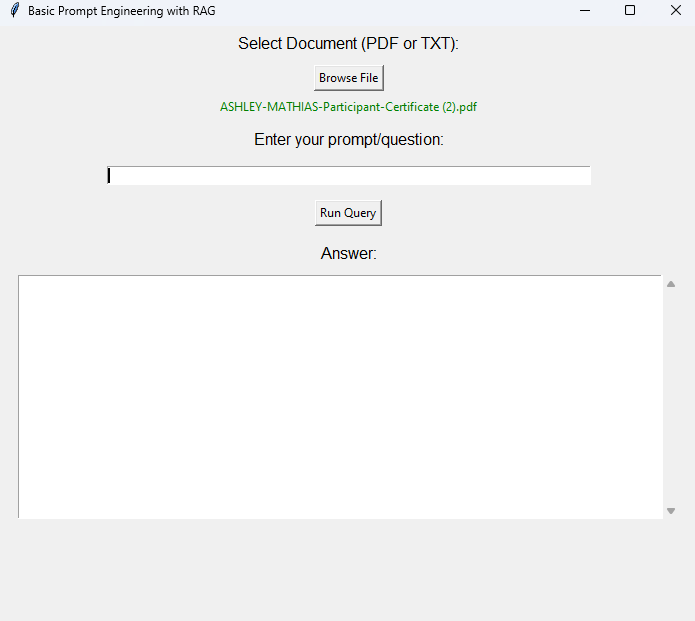

# 🧠 Basic Prompt Engineering with RAG


---

## 📘 Overview

**Basic Prompt Engineering with RAG** is a beginner-friendly, GUI-powered desktop app built in Python. It leverages **LangChain’s RAG (Retrieval-Augmented Generation)** to allow users to upload local documents and query them using natural language. The results are retrieved based on vector similarity using embeddings and context-aware responses powered by OpenAI.

---

## 🧰 Tech Stack

| Category        | Technology                                      |
|-----------------|--------------------------------------------------|
| 💻 Language      | Python 3.12                                     |
| 📚 Libraries     | `langchain`, `langchain_community`, `openai`, `faiss-cpu`, `PyPDF2`, `dotenv`, `tkinter` |
| 🧠 Embeddings    | OpenAI Embeddings                               |
| 🗃️ Vector Store  | FAISS                                           |
| 📁 Loaders       | PyPDFLoader, TextLoader                         |
| 🎨 GUI Framework | Tkinter                                         |

---

## ✨ Features

- 📄 Load `.pdf` or `.txt` documents locally
- 🤖 Ask natural language questions from those files
- ⚙️ Implements RAG with FAISS vector store
- 💬 Uses OpenAI’s embedding + language models
- 🖥️ Clean and colorful GUI interface using Tkinter

---

## 📸 Screenshots

<p align="center">
  
</p>

---

## 🚀 Getting Started

### 1️⃣ Clone the Repo

```bash
git clone https://github.com/your-username/basic-prompt-rag-tkinter.git
cd basic-prompt-rag-tkinter
```
### 2️⃣ Set Up API Key
- Create a .env file in the root:
-- OPENAI_API_KEY=your_openai_api_key_here

### 3️⃣ Install Dependencies
-- pip install -r requirements.txt
#### ℹ️ If you face langchain_community import errors, run:
-- pip install -U langchain-community

### 🧪 Usage

- Run the app using:
-- main.py
- Select a file (PDF or TXT)
- Enter your prompt (e.g., "Summarize this document")
- Click Run Query and view the output in the interface.

---

### 🙋‍♀️ About the Developer
- Ashley Mathias: 
- Python Developer & AI Enthusiast
- Linkedin: ashleymathias10, Github: Ashley Mathias

---

<p align="center">
  Built with 💻 and ☕ by <strong>Ashley Mathias</strong>
</p>

